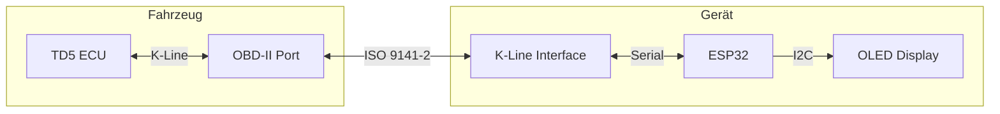
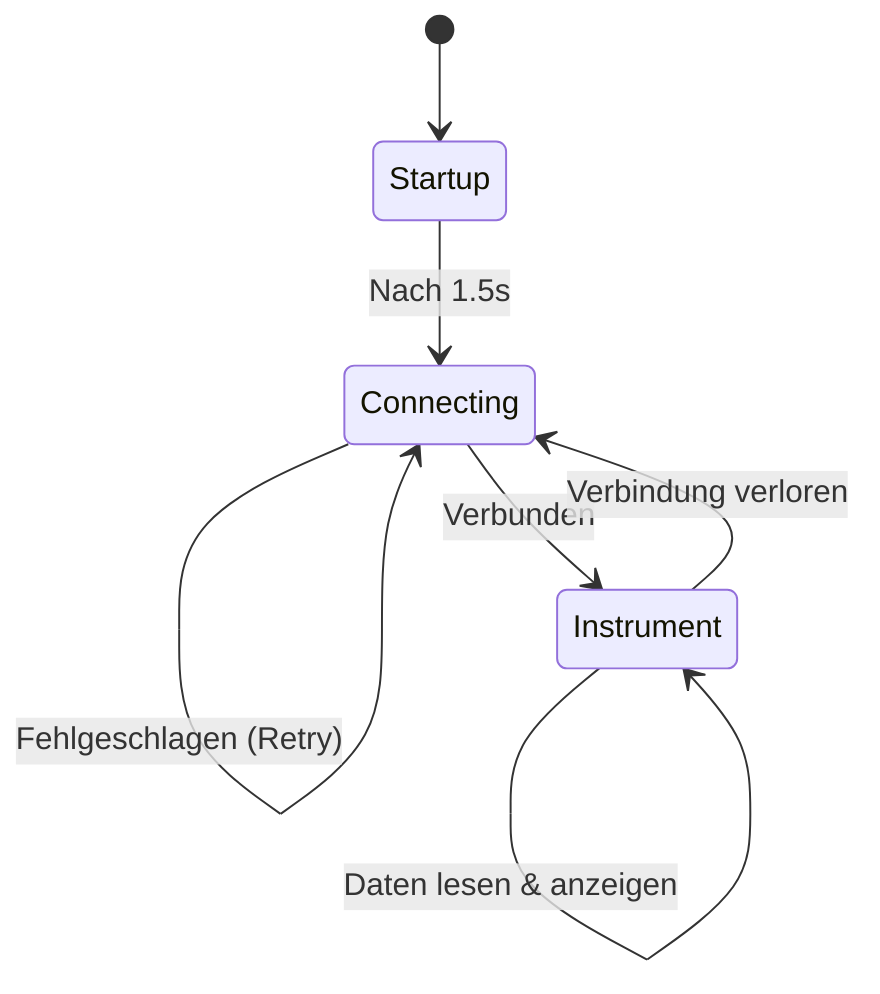

# TD5 RPM/Temp Monitor

Vereinfachtes ESP32-basiertes Anzeigegerät für Land Rover TD5 Motoren. Zeigt Drehzahl (RPM) und Kühlmitteltemperatur mit Verlaufskurve an.

Das Bild zeigt ein anderes Beispiel, hier Verbrauch.
Mehr Infos auf meiner dedizierten Seite zu dem Thema TD5: https://td5.390er.de 

[https://td5.390er.de/images/SSD1306_gross.jpg](https://td5.390er.de/images/SSD1306_gross.jpg)


Basiert auf [td5opencomstm32](https://github.com/BennehBoy/td5opencomstm32).

## Funktionen

- **Drehzahl (RPM)** in großer Schrift
- **Kühlmitteltemperatur** als Zahl
- **Temperaturverlaufskurve** (0-90°C) als Liniengraph
- **Automatische Verbindung** zur ECU mit Retry
- **Automatische Wiederverbindung** bei Verbindungsabbruch

## Display-Layout

```
+----------------------------+
| RPM: 2450           78C    |
|                     Temp   |
| 90 +------------------+    |
|    |    ~~~~~~~~~~~   |    |
|  0 +------------------+    |
+----------------------------+
```

## Architektur



### Programmablauf



## Hardware

### Komponenten

| Komponente | Beschreibung |
|------------|--------------|
| ESP32 DevKit | Beliebiges ESP32 Development Board |
| SSD1306 OLED | 128x64 Pixel, I2C Schnittstelle |
| K-Line Interface | K-Line Transceiver (z.B. L9637D, ELM327) |
| OBD-II Stecker | Für Fahrzeugverbindung |

### Verkabelung

```
ESP32 Pin       Funktion            Verbindung
---------       --------            ----------
GPIO16 (RX2)    K-Line RX      -->  Interface RXD
GPIO17 (TX2)    K-Line TX      -->  Interface TXD
GPIO21 (SDA)    I2C Data       -->  OLED SDA
GPIO22 (SCL)    I2C Clock      -->  OLED SCL
GPIO2           Status LED     -->  Eingebaute LED
3.3V            Stromversorgung ->  OLED VCC
GND             Masse          -->  Gemeinsame Masse
```

### K-Line Interface

```
        +12V (von OBD Pin 16)
          |
          +--[510R]--+
          |          |
         +-+        +-+
         |1|   VS   |8|  K-Line (OBD Pin 3)
         |2|   GND  |7|
         |3|   TXD  |6|
         |4|   RXD  |5|
         +-+        +-+
          |    |    |
         GND  TX   RX
              |    |
           GPIO17 GPIO16
```

### OBD-II Pinbelegung

| Pin | Funktion |
|-----|----------|
| 3   | K-Line (ISO 9141-2) |
| 4   | Chassis Masse |
| 5   | Signal Masse |
| 16  | +12V Batterie |

## Installation

### Voraussetzungen

- [Arduino IDE](https://www.arduino.cc/en/software) oder [arduino-cli](https://arduino.github.io/arduino-cli/)
- ESP32 Board Support Package
- Bibliotheken:
  - `Adafruit GFX Library`
  - `Adafruit SSD1306`

### Arduino IDE

1. ESP32 Board Support installieren:
   - Datei -> Einstellungen -> Zusätzliche Boardverwalter-URLs:
   - Hinzufügen: `https://raw.githubusercontent.com/espressif/arduino-esp32/gh-pages/package_esp32_index.json`
   - Werkzeuge -> Board -> Boardverwalter -> "ESP32" suchen -> Installieren

2. Bibliotheken installieren:
   - Sketch -> Bibliothek einbinden -> Bibliotheken verwalten
   - Suchen und installieren: `Adafruit GFX Library`, `Adafruit SSD1306`

3. `TD5_Dreh_Temp.ino` öffnen

4. Board auswählen: Werkzeuge -> Board -> ESP32 Dev Module

5. Hochladen

### arduino-cli

```bash
# ESP32 Core installieren
arduino-cli core install esp32:esp32

# Bibliotheken installieren
arduino-cli lib install "Adafruit GFX Library"
arduino-cli lib install "Adafruit SSD1306"

# Kompilieren
arduino-cli compile --fqbn esp32:esp32:esp32 TD5_Dreh_Temp

# Hochladen (Port anpassen)
arduino-cli upload -p /dev/cu.usbserial-0001 --fqbn esp32:esp32:esp32 TD5_Dreh_Temp
```

## Verwendung

1. OBD-II Kabel mit Fahrzeug verbinden
2. Zündung einschalten (Motor kann aus oder an sein)
3. Gerät startet automatisch und verbindet sich mit dem ECU
4. Nach erfolgreicher Verbindung werden RPM und Temperatur angezeigt

## Fehlerbehebung

### Keine ECU-Verbindung

- K-Line Verkabelung prüfen (Interface-Anschlüsse)
- +12V Versorgung des K-Line Interface prüfen
- Zündung muss eingeschaltet sein
- Gerät versucht automatisch erneut zu verbinden

### Display funktioniert nicht

- I2C Adresse prüfen (Standard 0x3C, manche Displays nutzen 0x3D)
- SDA/SCL Verbindungen prüfen
- I2C Scanner ausführen um Adresse zu ermitteln

## Projektstruktur

```
TD5_Dreh_Temp.ino     - Hauptprogramm
td5comm.cpp/h         - ECU K-Line Kommunikation
td5hmi.cpp/h          - Display-Funktionen mit Temperaturkurve
td5defs.h             - Pin-Definitionen und Konfiguration
keygen.h              - Seed-Key Authentifizierung
```

## Credits

- **Original td5opencom**: [Luca Veronesi](https://github.com/luca72)
- **STM32 Port**: [BennehBoy](https://github.com/BennehBoy/td5opencomstm32)
- **Seed-Key Algorithmus**: [paul@discotd5.com](https://discotd5.com)

## Lizenz

Dieses Projekt steht unter der **GNU Lesser General Public License v2.1** (LGPL-2.1).

## Haftungsausschluss

Dieses Werkzeug dient nur zu Diagnosezwecken. Nutzung auf eigene Gefahr. Die Autoren übernehmen keine Haftung für Schäden am Fahrzeug oder ECU.
